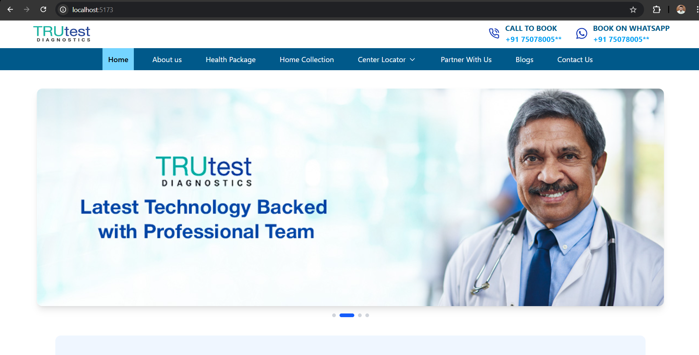
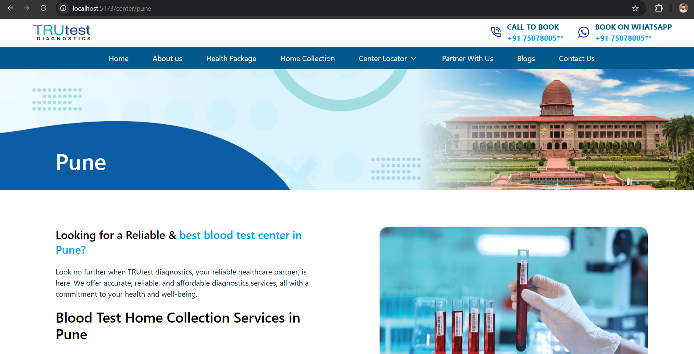
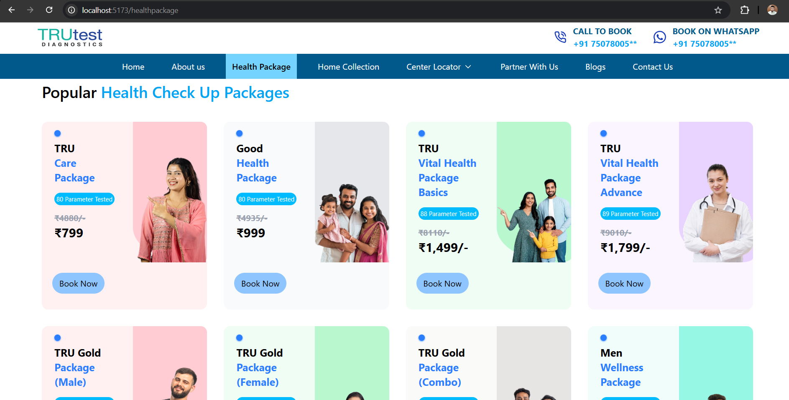
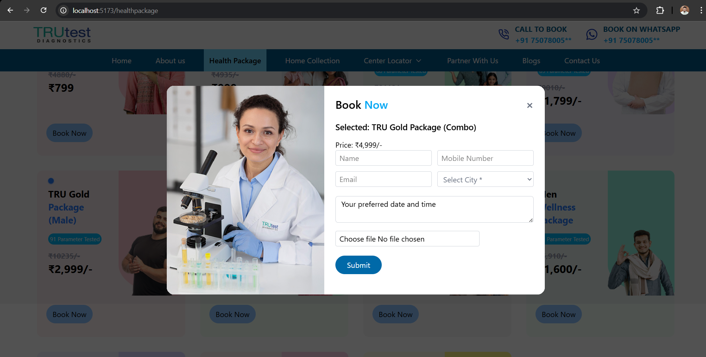

# TRUtest Diagnostics — Practice UI Clone

> **Disclaimer:**  
> This project is a **practice clone** created **only for learning and design practice**.  
> It is **not affiliated with, endorsed by, or connected to TRUtest Diagnostics**.  
> All brand names, images, and references are used strictly for **educational purposes**.

---

## 📌 About the Project

This is a **frontend UI clone** of the TRUtest Diagnostics website, built to practice modern web development skills using **React and Tailwind CSS**.

The project focuses on:
- Clean UI layout
- Responsive health package cards
- Modal-based booking form
- Background scroll locking
- Component-based architecture

---

## 🛠️ Tech Stack

- **React.js** (Functional Components & Hooks)
- **Tailwind CSS**
- **JavaScript (ES6+)**
- **HTML5 & CSS3**

---

## ✨ Features

- 📦 Health package cards with dynamic data
- 🧾 Modal popup booking form
- 🔒 Background scroll lock when modal opens
- 🌫️ Dimmed & blurred background overlay
- 📱 Fully responsive design (Mobile / Tablet / Desktop)
- ♻️ Clean and reusable component structure

---

## 🖥️ Screens Implemented

- Home banner section
- Health packages listing
- “Book Now” modal popup
- Responsive grid layout

---
## 🚀 Getting Started

- Navigate to project folder
```bash
cd TRUtest

- Start developer server
npm run dev

- the app will run at 
http://localhost:5173

---

##  Project Structure

TRUtest/
├── Images/
├── public/
│   ├── HomePage.png
│   ├── CenterPage.png
│   ├── HealthPackage.png
│   └── FormPage.png
├── src/
│   ├── Cities/
│   ├── Components/
│   ├── Layout/
│   ├── pages/
│   ├── App.js
│   └── main.jsx
├── README.md
└── package.json


---

##  Screenshots

### Home Page


### Center Page


### Healthpackage


### Form Page

